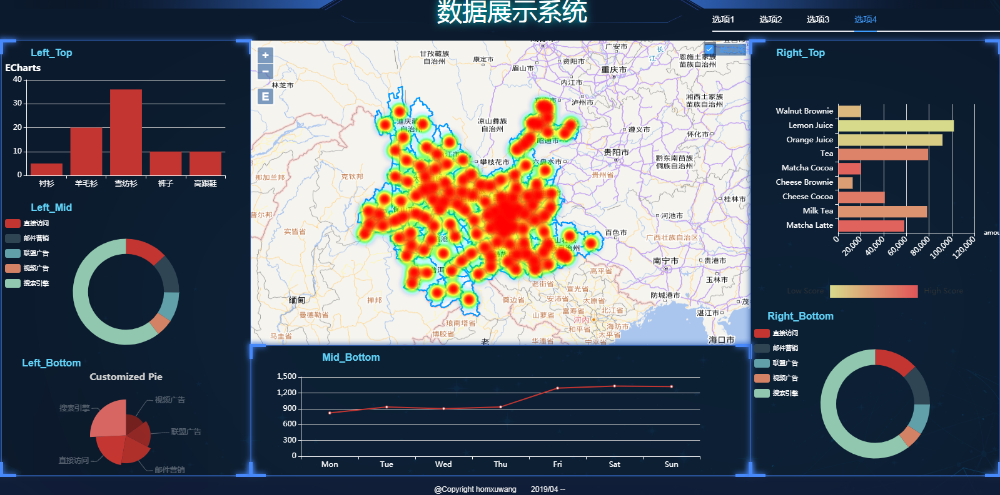

# ShowUrData

> A Vue.js project

## Build Setup

``` bash
# install dependencies
npm install

# serve with hot reload at localhost:8080
npm run dev

# build for production with minification
npm run build

# build for production and view the bundle analyzer report
npm run build --report
```

在线展示： https://homxuwang.github.io/ShowUrDatas/
由于gitpages的原因，无法加载地图的json文件。如果想看地图效果，建议clone后在本地运行:)

界面截图:


For a detailed explanation on how things work, check out the [guide](http://vuejs-templates.github.io/webpack/) and [docs for vue-loader](http://vuejs.github.io/vue-loader).
